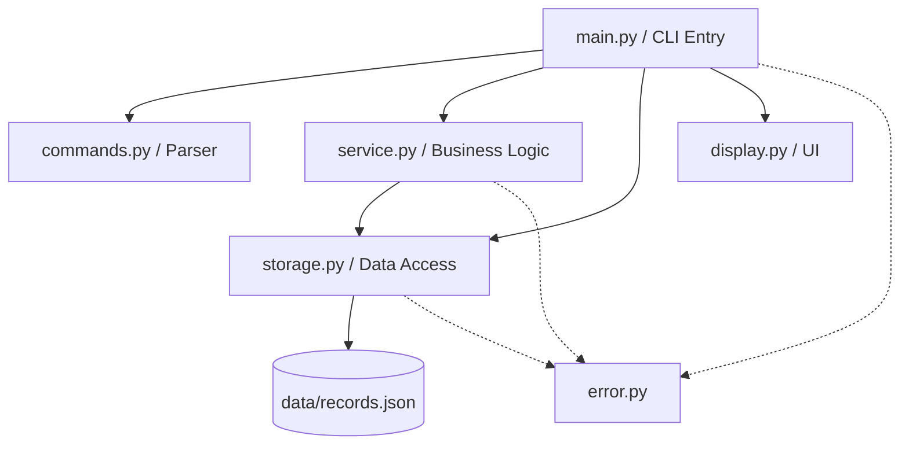

# CashTrack CLI - SDD v1.0

## 1. 專案概覽（Project Overview）

- 程式名稱：CashTrack 記帳系統
- 版本：v1.0
- 一句話描述：一個可記錄個人收入與支出的記帳工具
- 目標使用者：想快速記錄日常收支的個人使用者
- 核心價值：提供簡單的記帳方式

---

## 2. CLI 介面規格（Interface Specification）

### 指令列表

| 指令     | 參數        | 說明     | 範例      |
| ------------ | ----- | --------------------- | --------------- |
| `add`    | `[--type income\|expense] --name TEXT --amount FLOAT [--note TEXT] [--category TEXT]` | 新增一筆記錄（name 與 amount 為必填），type 缺少時會進入到互動選擇 | `python main.py add --type expense --name "lunch" --amount 120 --category food --note "noodles"` |
| `list`   | `--type income\|expense\|all`（預設 `all`）  | 列出記錄，可依類型篩選 | `python main.py list --type expense`   |
| `update` | （無 CLI 參數，互動式更新）  | 透過互動方式更新記錄  | `python main.py update`   |
| `delete` | `--id INT`  | 刪除指定 ID 的記錄  | `python main.py delete --id 1`    |

### 指令執行後的輸出
- `add` / `update` / `delete` / `list` 指令執行後：
  - 顯示對應操作訊息（例如 `Added record.`）
  - 顯示目前所有記錄的表格
  - Total Income
  - Total Expense
  - Balance
---

## 3. 資料模型（Data Model）

### Record

| 欄位         | 型別  | 說明                                   | 必填            |
| ------------ | ----- | -------------------------------------- | --------------- |
| `id`         | int   | 唯一識別碼，自動遞增                   | ✅              |
| `type`       | str   | 收入或支出，值為 `income` 或 `expense` | ✅              |
| `name`       | str   | 項目名稱                               | ✅              |
| `amount`     | float | 金額，必須大於 0                       | ✅              |
| `category`   | str   | 分類，例如 food、transport、salary     |                 |
| `note`       | str   | 備註說明                               |                 |
| `created_at` | str   | 建立時間（ISO 格式）                   | ✅ (由系統建立) |

### json 儲存格式

```json
[
  {
    "id": 1,
    "type": "expense",
    "name": "name",
    "amount": 1000.0,
    "category": "test",
    "note": "note",
    "created_at": "2026-03-18 10:35:06"
  }
]
```

## 4. 模組架構（Module Design）



**簡要說明**

- `main.py`：CLI 入口與參數解析
- `commands.py`: 指令設計，subparser 總共有四個指令，分別是 add、update、list 和 delete
- `service.py`：負責核心功能，包含 CRUD 該如何實作
- `storage.py`: 和資料有關的 function，包含載入和儲存資料
- `data/records.json`: 資料儲存位置，當作暫時資料庫使用
- `display.py`: 繪製表格顯示結果給使用者查看

## 5. 錯誤處理規格（Error Handling）

### 錯誤分類

- Usage Error（使用方式錯誤）：CLI 指令使用不正確，例如缺少必填參數或參數格式錯誤。
- Validation Error（資料驗證錯誤）：輸入資料不符合欄位規則，例如不支援的 type 或金額小於等於 0。
- Business Error（業務邏輯錯誤）：輸入格式正確，但操作目標不符合業務邏輯，例如找不到指定的記錄（ID 不存在）。
- Storage Error（資料存取錯誤）：資料讀寫過程發生錯誤，例如 JSON 檔案損毀、檔案無法讀取或寫入、權限不足等。
- System Error（系統錯誤）：未預期的執行時錯誤，不屬於上述分類，例如程式錯誤或未知例外。

### Exit Code

| Code | 代表意思                                       |
| ---- | ---------------------------------------------- |
| 0    | Success                                        |
| 1    | Validation / Business / Storage / System error |
| 2    | Usage error                                    |

### 錯誤情境

| 情境                                          | 錯誤分類         | 預期行為                                                                   | 退出碼 |
| --------------------------------------------- | ---------------- | -------------------------------------------------------------------------- | ------ |
| CLI 缺少必要參數                              | Usage Error      | 顯示使用方式並退出                                                         | 2      |
| add / update 的 type 非 `income` 或 `expense` | Validation Error | 顯示錯誤訊息；若為互動模式則重新輸入，否則退出                             | 1      |
| list 的 type 非 `income`、`expense` 或 `all`  | Usage Error | 顯示使用方式並退出                                                         | 2      |
| 單項記錄金額小於或等於 0                      | Validation Error | 顯示錯誤訊息 `[ERROR] ValidationError: Amount must be greater than 0. Keeping original value.` 並退出或保留原值（update 互動模式） | 1      |
| 找不到 ID                                     | Business Error   | 跳出 `[ERROR] BusinessError: Record with ID [ID] not found.` 並退出                              | 1      |
| JSON 檔案讀取失敗（檔案無法開啟）        | Storage Error | 顯示 `[ERROR] StorageError: Failed to load records file: {e}` 並退出  | 1         |
| JSON 檔案格式錯誤（JSON parse 失敗） | Storage Error | 顯示 `[ERROR] StorageError: Failed to parse records file: {e}` 並退出 | 1         |
| JSON 檔案寫入失敗                | Storage Error | 顯示 `[ERROR] StorageError: Failed to save records file: {e}` 並退出  | 1         |
| 非預期 runtime error                          | System Error     | 顯示通用錯誤訊息並退出                                                     | 1      |
| 無任何紀錄可更新 | Business Error | 顯示 `[ERROR] BusinessError: No records available.` 並退出 | 1 |

## 6. 測試案例（Test Cases）

**Add**

| 功能 | 輸入 | 預期結果 | 通過條件 |
|------|------|----------|----------|
| 新增收入 | `python main.py add --type income --name Salary --amount 5000 --category Job --note August` | 顯示 `Added: [id] Salary`，資料成功寫入並出現在列表中 | stdout 含 `Added:` 且退出碼為 0 |
| 新增支出 | `python main.py add --type expense --name Lunch --amount 120 --category Food --note Bento` | 顯示 `Added: [id] Lunch`，資料成功新增並出現在列表中 | stdout 含 `Added:` 且退出碼為 0 |
| 不提供 category 與 note | `python main.py add --type expense --name Coffee --amount 60` | category 為 `-`，note 為空字串 | stdout 表格中該筆 category 欄為 `-`，note 欄為空，退出碼為 0 |
| 互動選擇 type | `python main.py add --name Bonus --amount 1000` | 系統要求選擇 type，完成後新增資料，且資料於列表中呈現 | stdout 含 `Added:` 且退出碼為 0 |
| 互動選擇 type（type 選擇不在列表中的項目） | `python main.py add --name Bonus --amount 1000` | 系統要求重新選擇 type，直到選擇到列表中任一選項 | stdout 含錯誤提示並重新要求輸入，最終成功新增後退出碼為 0 |
| amount 為負數 | `python main.py add --type expense --name Refund --amount -50` | 顯示 `[ERROR] ValidationError: Amount must be greater than 0.` | stdout 含 `ValidationError` 且退出碼為 1 |
| amount 非數字 | `python main.py add --type expense --name Tea --amount abc` | argparse 報錯並中止程式 | stderr 含 `invalid float value` 且退出碼為 2 |

---

**List**

| 功能 | 輸入 | 預期結果 | 通過條件 |
|------|------|----------|----------|
| 列出全部資料 | `python main.py list --type all` | 顯示所有 records 與 totals，和總支出與總收入 | stdout 含表格與 `Total Income`、`Total Expense`、`Balance`，退出碼為 0 |
| 只列收入 | `python main.py list --type income` | 僅顯示 type 為 income 的資料，總支出顯示為 0 | stdout 不含 expense 記錄，含 `Total Expense: 0.00`，退出碼為 0 |
| 只列支出 | `python main.py list --type expense` | 僅顯示 type 為 expense 的資料，總收入顯示為 0 | stdout 不含 income 記錄，含 `Total Income: 0.00`，退出碼為 0 |
| type 不在列表內 | `python main.py list --type 123` | argparse 報錯並中止程式 | stderr 含 `invalid choice` 且退出碼為 2 |

---

**Update**

| 功能 | 輸入 | 預期結果 | 通過條件 |
|------|------|----------|----------|
| ID 非數字或按 enter | `python main.py update` → 輸入 abc | 顯示 `[ERROR] ValidationError: Invalid ID. Please enter a number.`，不更新資料 | stdout 含 `ValidationError` 且退出碼為 1，資料無變動 |
| ID 不存在 | `python main.py update` → 輸入不存在 ID | 顯示 `[ERROR] BusinessError: Record with ID 999 not found.` | stdout 含 `BusinessError` 且退出碼為 1，資料無變動 |
| 更新 name | `python main.py update` → 輸入 ID → 輸入新 name | 顯示 `Updated: [id] [新的 name]` | stdout 含 `Updated:` 且退出碼為 0，列表中該筆 name 已更新 |
| name 按 enter | `python main.py update` → 輸入 ID → name 按 enter | 保持原本的 name | stdout 含 `Updated:` 且退出碼為 0，列表中該筆 name 不變 |
| 更新 type | `python main.py update` → 輸入 ID → 輸入 income/expense | type 成功更新並顯示 `Updated: [id] [該 id 紀錄名稱]` | stdout 含 `Updated:` 且退出碼為 0，列表中該筆 type 已更新 |
| type 輸入錯誤後重輸 | `python main.py update` → type 輸入錯誤值再輸入正確值 | 顯示 `[ERROR] ValidationError: Type must be 'income' or 'expense'...` 並重新要求輸入 | stdout 含 `ValidationError` 提示後繼續互動，最終退出碼為 0 |
| type 直接 Enter | `python main.py update` → 輸入 ID → type 按 Enter | 保持原本 type | stdout 含 `Updated:` 且退出碼為 0，列表中該筆 type 不變 |
| 更新 amount | `python main.py update` → 輸入數值 | amount 更新成功，顯示 `Updated: [id] [該 id 紀錄名稱]` | stdout 含 `Updated:` 且退出碼為 0，列表中該筆 amount 已更新 |
| amount 為負數 | `python main.py update` → 輸入 -10 | 顯示 `[ERROR] ValidationError: Amount must be greater than 0. Keeping original value.` | stdout 含 `ValidationError` 且退出碼為 0，該筆 amount 保持原值 |
| amount 非數字 | `python main.py update` → 輸入 abc | 顯示 `[ERROR] ValidationError: Invalid amount format. Keeping original value.` | stdout 含 `ValidationError` 且退出碼為 0，該筆 amount 保持原值 |
| amount 直接 Enter | `python main.py update` → 輸入 ID → amount 按 Enter | 保持原本 amount | stdout 含 `Updated:` 且退出碼為 0，列表中該筆 amount 不變 |
| 更新 category | `python main.py update` → 輸入 ID → 輸入新 category | 顯示 `Updated: [id] [name]` | stdout 含 `Updated:` 且退出碼為 0，列表中該筆 category 已更新 |
| category 按 enter | `python main.py update` → 輸入 ID → category 按 enter | 保持原本的 category | stdout 含 `Updated:` 且退出碼為 0，列表中該筆 category 不變 |
| 更新 note | `python main.py update` → 輸入 ID → 輸入新 note | 顯示 `Updated: [id] [name]` | stdout 含 `Updated:` 且退出碼為 0，列表中該筆 note 已更新 |
| note 按 enter | `python main.py update` → 輸入 ID → note 按 enter | 保持原本的 note | stdout 含 `Updated:` 且退出碼為 0，列表中該筆 note 不變 |
| 無任何紀錄可更新 | `python main.py update`（無資料時） | 顯示 `[ERROR] BusinessError: No records available.` | stdout 含 `BusinessError` 且退出碼為 1 |

---

**Delete**

| 功能 | 輸入 | 預期結果 | 通過條件 |
|------|------|----------|----------|
| 成功刪除 | `python main.py delete --id 3` | 顯示 `Deleted: [3] salary`，資料被移除並印出更新後列表 | stdout 含 `Deleted:` 且退出碼為 0，列表中該筆記錄不再存在 |
| 刪除不存在 ID | `python main.py delete --id 999` | 顯示 `[ERROR] BusinessError: Record with ID 999 not found.` | stdout 含 `BusinessError` 且退出碼為 1，資料無變動 |